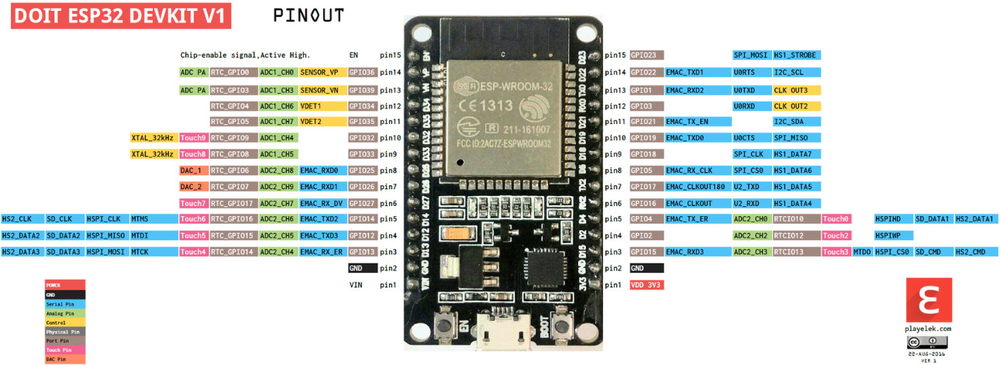

# Biblioteca para o sensor BMP180 (possui erros na aquisição)
Algoritmo para requisitar dados de pressão e temperatura do sensor BMP180 utilizando as funções da [ESP-IDF](https://docs.espressif.com/projects/esp-idf/en/latest/esp32/get-started/index.html#).

## Pré-requisitos
Para compilar o programa em seu ESP, deve possuir na máquina a [ESP-IDF](https://docs.espressif.com/projects/esp-idf/en/latest/esp32/get-started/index.html#) instalada na máquina.

## Possíveis alterações
Para a realização dos testes do código foi utilizado o **ESP-WROOM-32**. Portanto, deve visualizar no arquivo **sdkconfig** se o chip é o mesmo, caso contrário, mude.

## Conselho
Para que não tenha "dores de cabeça" para modificar o arquivo, crie um projeto simples pela própria IDF com as configurações compatíveis com seu microcontrolador. Depois, basta criar um novo componente pra incluir os arquivos de cabeçalho, e por fim substituir os arquivos ".cpp" e ".h" e rodar o comando"_build_".

## Referências
Para a criação do código foram utilizados o _datasheet_ do sensor (localizado no diretório _datasheet_/) juntamente com a blioteca para o Arduino IDE.

* [Biblioteca referência](https://github.com/enjoyneering/BMP180);
* [ESP-IDF](https://docs.espressif.com/projects/esp-idf/en/latest/esp32/get-started/index.html#);
* [Datasheet](https://pdf1.alldatasheet.com/datasheet-pdf/view/1132068/BOSCH/BMP180.html).

